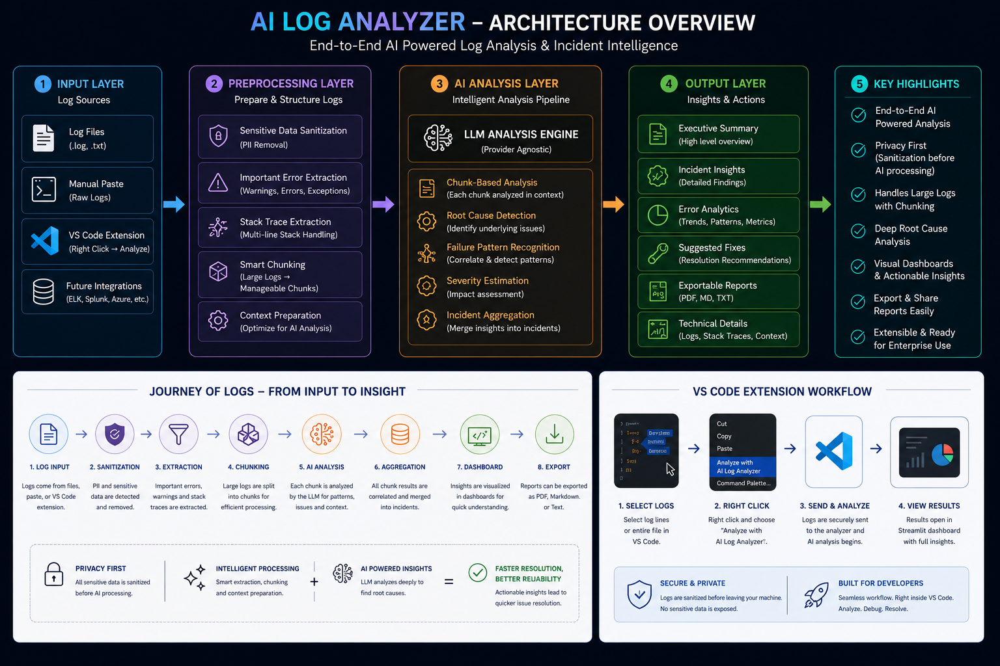
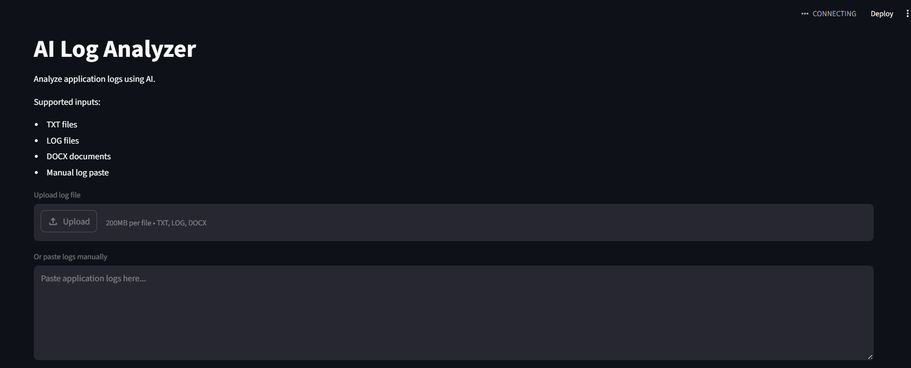
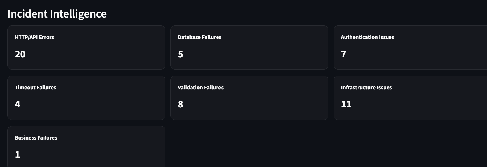
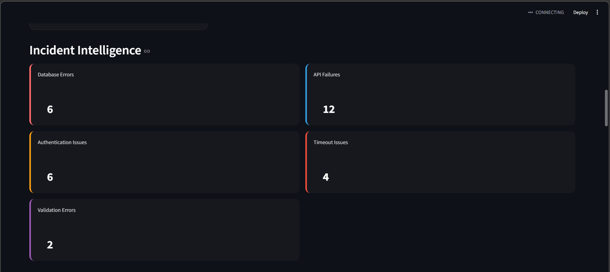
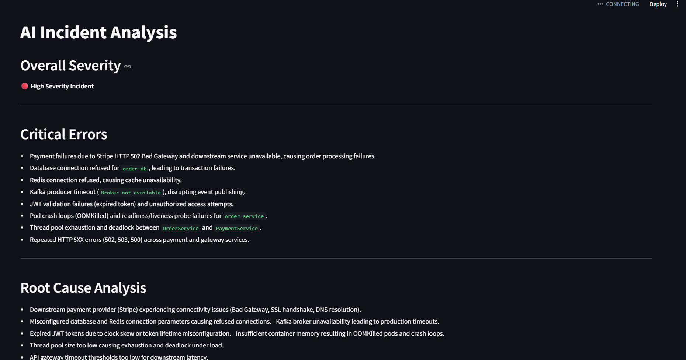
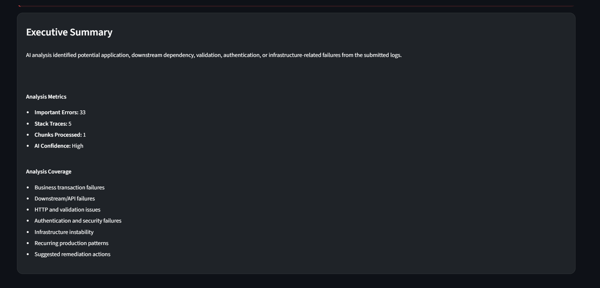
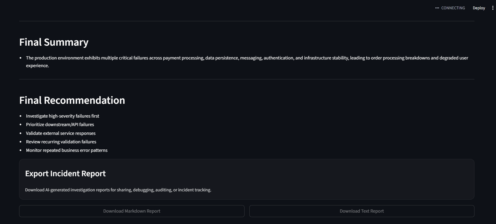

# AI Log Analyzer

AI-powered log intelligence and incident investigation platform for developers, QA teams, and DevOps engineers.

Analyze production logs using LLMs with:
- privacy-aware sanitization
- intelligent preprocessing
- structured incident summaries
- root cause analysis
- VS Code integration

---

## Key Features

✅ AI-powered incident analysis  
✅ Privacy-first log sanitization  
✅ Smart log chunking  
✅ Structured debugging insights  
✅ VS Code extension support  
✅ Exportable incident reports  

The long-term vision is to evolve AI Log Analyzer into:
> An AI-powered incident investigation and developer productivity tool.

---
# System Architecture



# Why This Project Exists

Developers and QA teams spend significant time:
- Reading large log files manually
- Searching stack traces
- Identifying root causes
- Debugging repetitive failures
- Summarizing incidents

AI Log Analyzer aims to reduce debugging effort by combining:
- AI-powered reasoning
- smart log preprocessing
- privacy-aware sanitization
- structured incident analysis

---

# Project Vision

This project is being built as part of a hands-on AI Engineering journey focused on:
- AI product engineering
- LLM integrations
- developer tooling
- AI workflows
- open-source engineering
- real-world software problems

The goal is not just to build another AI demo, but to create:
> A genuinely useful engineering productivity tool.

---

# Current Features

## AI-Powered Log Analysis
- AI-generated incident summaries
- Root cause analysis
- Suggested remediation steps
- Severity estimation
- Structured incident reports

## Smart Log Processing
- Important error extraction
- Stack trace prioritization
- Large log chunking
- Noise reduction
- Context-aware preprocessing

## Incident Intelligence
- API failure detection
- Timeout detection
- Authentication issue tracking
- Validation error analysis
- Exception frequency insights

## Developer Productivity Features
- Markdown report export
- Text report export
- Technical diagnostics view
- Sanitized log preview
- Chunk analysis tracking

## UI Features
- Incident severity ribbons
- KPI dashboards
- Error analytics cards
- Expandable technical sections
- Responsive Streamlit layout

## AI Infrastructure
- OpenRouter integration
- OpenAI-compatible architecture
- Prompt engineering pipeline
- Multi-pass chunk analysis
- Structured AI response aggregation


---

# Planned Features

# Phase 1 — MVP Foundation
- Basic log upload
- AI log analysis
- Root cause summaries
- Error extraction
- Multi-format support

---

# Phase 2 — Smart Processing

## Privacy & Security
- Sensitive data sanitization
- API key masking
- Token detection
- IP/email masking

## Large Log Handling
- Smart chunking
- Multi-pass analysis
- Context-aware summarization
- Log prioritization

## AI Improvements
- Structured AI responses
- Error categorization
- Failure clustering
- Severity scoring

---

# Phase 3 — Developer Productivity Features

- PDF incident reports
- Exportable summaries
- Jira ticket generation
- Stack trace highlighting
- Multi-log comparison
- Incident timeline generation
- AI debugging recommendations

---

# Phase 4 — Extension & Open Source Direction

## Browser Extension
Planned support for:
- Chrome Extension
- Right-click log analysis
- Clipboard log analyzer

## IDE Integrations
Future ideas:
- VS Code extension
- CI/CD integrations
- Slack/Jira integrations

## Open Source Goals
- Community contributions
- Modular architecture
- Provider-agnostic AI support
- Self-hosted/local AI compatibility

---

# Privacy-First Design

Logs may contain sensitive enterprise information.

Future versions of AI Log Analyzer will include:
- Local sanitization before AI processing
- Sensitive data masking
- Secure preprocessing workflows
- Configurable privacy rules

Example:

```text
Authorization: Bearer sk-123456789
```

becomes:

```text
Authorization: Bearer [REDACTED_API_KEY]
```

This makes the tool safer for:
- enterprise environments
- production debugging
- shared incident analysis

---

# Architecture Direction

Current MVP flow:

```text
Upload Logs
    ↓
Preprocessing Pipeline
    ↓
Sensitive Data Sanitization
    ↓
Important Error Extraction
    ↓
Smart Chunking Engine
    ↓
Multi-Pass AI Analysis
    ↓
Structured Incident Aggregation
    ↓
Incident Intelligence Dashboard
    ↓
Exportable Incident Reports
```

---

# Tech Stack

| Area | Technology |
|---|---|
| Language | Python |
| UI | Streamlit |
| AI Integration | OpenRouter / OpenAI |
| Environment | VS Code |
| Data Processing | Pandas |
| Secrets Management | Python Dotenv |
| HTTP Client | HTTPX |

---

# Project Structure

```bash
ai-log-analyzer/
│
├── app.py
├── requirements.txt
├── README.md
├── .env
│
├── components/
│   ├── ai_failure.py
│   ├── alerts.py
│   ├── analysis_result.py
│   ├── analysis_summary.py
│   ├── error_analytics.py
│   ├── export_section.py
│   ├── header.py
│   ├── incident_cards.py
│   ├── incident_insights.py
│   ├── metrics.py
│   ├── styles.py
│   ├── technical_details.py
│   ├── ui_warnings.py
│   └── upload_section.py
│
├── config/
├── services/
│   ├── ai_service.py
│   ├── analysis_service.py
│   └── preprocessing_service.py
│
├── utils/
│   ├── analyzer.py
│   ├── chunker.py
│   ├── doc_reader.py
│   ├── error_categorizer.py
│   ├── exception_extractor.py
│   ├── file_handler.py
│   ├── incident_insights.py
│   ├── metrics_helper.py
│   ├── prompt_builder.py
│   ├── report_exporter.py
│   ├── report_formatter.py
│   ├── report_parser.py
│   ├── sanitizer.py
│   └── stacktrace_extractor.py
│
├── sample_logs/
├── models/
│
├── docs/
│   ├── PROJECT_CONTEXT.md
│   └── SPRINT_PLAN.md
│
└── reports/
...
```
---
# VS Code Extension Workflow

The VS Code extension allows developers to:

1. Select logs directly inside VS Code
2. Launch AI Log Analyzer instantly
3. Auto-populate logs into the analyzer
4. Generate AI-powered debugging insights

This creates a faster developer workflow for:
- production debugging
- API failure analysis
- incident investigation
- stack trace analysis


# Development Philosophy

This project follows:
- iterative development
- weekly sprint cycles
- public learning
- real-world engineering practices

The focus is:
> Build small → improve continuously → ship consistently.

---

# Sprint-Based Development

Development is organized into:
- 1-week engineering sprints
- feature-focused milestones
- continuous improvements

Planned sprint areas include:
- sanitization
- large log handling
- structured AI output
- extension support
- deployment
- open-source readiness

---

# Future AI Goals

Potential advanced AI features:
- anomaly detection
- incident prediction
- semantic log search
- AI-powered debugging assistant
- multi-agent incident analysis

---

# Open Source Vision

AI Log Analyzer is planned to become:
- open source
- community-driven
- extensible
- provider-agnostic

Future support may include:
- OpenAI
- OpenRouter
- Anthropic
- Ollama/local models


# VS Code Extension Vision

A planned VS Code extension will allow engineers to:

- Paste logs directly from ELK/Splunk/Grafana
- Analyze logs without leaving the editor
- Generate AI incident summaries instantly
- Highlight failures and stack traces
- Improve debugging workflows

This aligns with real-world developer and production-support workflows.


---
# VS Code Extension Workflow

The VS Code extension allows developers to:

1. Select logs directly inside VS Code
2. Launch AI Log Analyzer instantly
3. Auto-populate logs into the analyzer
4. Generate AI-powered debugging insights

This creates a faster developer workflow for:
- production debugging
- API failure analysis
- incident investigation
- stack trace analysis

# Demo Scenarios

Sample logs are included for:
- payment gateway failures
- downstream API timeouts
- Kafka/MQ failures
- authentication failures
- validation errors

These examples demonstrate the AI analysis workflow and incident reporting capabilities.

# Screenshots

- dashboard screenshots
- AI incident reports
- analytics UI
- VS Code extension demo
Have a look on the Tool's screenshots:








# Learning Goals Behind This Project

This project is also part of a broader AI engineering roadmap focused on:
- AI engineering
- LLM application development
- AI system design
- developer productivity tooling
- production AI workflows

---

# Author : Tanisha Trivedi

Built as part of an AI Engineering learning journey focused on building practical AI-powered developer tools.
````
